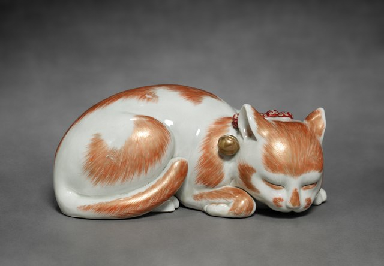
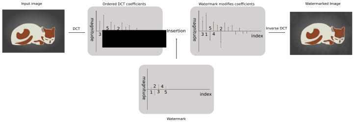
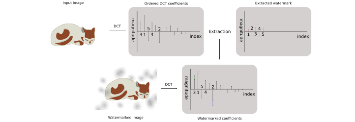

# Spread Spectrum Watermarking

A crate to perform spread spectrum watermarking on images.

This is a non-blind watermarking scheme that requires access to the original image to extract the watermark from a watermarked image.
The watermark is encoded in the frequency domain, using the most significant coefficients that make up the image. This ensures that the watermark is robust and even persists when high frequency components are eliminated, as happens with blurring through compression or resizing.

## An example

To get an impression of how this looks, let us consider [this](https://commons.wikimedia.org/wiki/File:Japan,_Edo_Period_-_Sleeping_Cat-_Ko_Imari_Type_-_1964.255_-_Cleveland_Museum_of_Art.tif) public domain image of a cat figurine. This image is deliberately picked to make it relatively easy to observe the effects of the watermark.

The orginal image has a smooth grey background:


After embedding a watermark (of length 1000, sampled from a standard normal distribution, embedding coefficient 0.1) the following result is obtained:



The background has become 'cloudy' but the image itself is still sharp and visually appealing. In images without smooth gradients or regions with a solid color it is very hard to see the presence of the watermark without access to the original.

These example images are created with the [single_simple.rs](tests/single_simple.rs) test.


## Background

This crate roughly follows the algorithm described in the following paper:
> J. Cox, J. Kilian, F. T. Leighton and T. Shamoon,
> "[Secure spread spectrum watermarking for multimedia,](https://ieeexplore.ieee.org/document/650120/)"
> in IEEE Transactions on Image Processing, vol. 6, no. 12, pp. 1673-1687, Dec. 1997,
> doi: 10.1109/83.650120.

This algorithm is also described in (expired) patent [US5930369](https://patents.google.com/patent/US5930369).

This code is a rewrite of my [python implementation](https://github.com/iwanders/spread_spectrum_watermarking/tree/legacy_python_implementation) from 2013.

## Embedding a watermark




To embed a watermark, the following steps are performed:

1. Convert the RGB image to [YIQ](https://en.wikipedia.org/wiki/YIQ) color space.
2. Compute the discrete consine transform on the Y channel.
3. Sort the coefficients by energy, or another metric. In the diagram the coefficients are numbered 1-5 based on magnitude.
4. Embed the watermark into the strongest coefficients, using equations of step 42 of the patent. The watermark is usually a sequence of floats sampled from a standard normal distribution. This sequence is modulated into the most significant coefficients of the original image. (Skipping the DC gain at index 0). In the diagram, we stems from the watermark's indices added to their coefficient counterparts from the original image.
5. Perform the inverted discrete cosine transform using the updated coefficients obtained from embedding the watermark.
6. Convert image back from YIQ to RGB color space to obtain the watermarked image.


## Extracting a watermark


To extract and test for a watermark, the following steps are performed:
1. Perform step 1 to 3 of the embedding procedure using the original (non-watermarked) image. Obtaining the coefficients from the original and numbered by significance.
2. Perform step 1 and 2 of the embedding procedure using the watermarked image. Obtaining the coefficients from the watermarked image, ready to be indexed into.
3. Using the coefficients - as sorted from the original values - and their counterparts from the watermarked image, we can extract the change present in the watermarked image. This is the retrieved watermark $X^\star$.
4. The retrieved watermark $X^\star$ is never identical to the original watermark that was embedded $X$. A similarity score or correlation coefficient can then be computed. In the patent the following similarity score is used:
$$\text{sim}\left( X, X^\star \right) = \frac{X^\star\cdot X}{\sqrt{X^\star \cdot X^\star}}$$
Which has the convenient properties that $\text{sim}\left(X, X^*\right)$ itself is distributed according to the normal distribution, which means that if this value exceeds several sigma's, it is very likely that the watermark was indeed detected.
Note that once the watermark is extracted, it can be tested cheaply for similarity between any number of watermarks that are stored and have been used for watermarking in the past.

# Usage
Also take a look at the examples and integration test in addition to the the examples given here.

## Embedding a watermark
```rust
use spread_spectrum_watermarking as wm;
// Load the image from disk.
let orig_image = image::open("tests/porcelain_cat_grey_background.jpg").unwrap();

// Generate a new watermark. This should be stored somewhere, such that you can check whether
// it is present in an image. The recommended watermark is sampled from a normal distribution,
// the paper always uses a length of 1000 for their tests.
let mark = wm::MarkBuf::generate_normal(1000);

// Write the watermark to the image using default configuration, alpha = 0.1.
let config = wm::WriteConfig::default();
let watermarker = wm::Writer::new(orig_image, config);
let res = watermarker.mark(&[&mark]);

// Convert the now watermarked image back to 8 bits and write to disk.
let img_back_to_rgb = res.into_rgb8();
img_back_to_rgb.save("/tmp/watermarked.png").unwrap();
```

## Extracting and testing for a watermark.
```rust
use spread_spectrum_watermarking as wm;
// Load the original image, this is necessary to extract the watermark.
let orig_image = image::open("tests/porcelain_cat_grey_background.jpg").unwrap();
let watermarked_image = image::open("tests/watermarked_with_1.png").unwrap();

// Create the reader for the watermark using default configuration.
let read_config = wm::ReadConfig::default();
let reader = wm::Reader::base(orig_image, read_config);
let derived = wm::Reader::derived(watermarked_image);

// Extract the watermark of length 1000.
let mut extracted_mark = vec![0f32; 1000];
reader.extract(&derived, &mut extracted_mark);

let mark_to_check_for = [0f32; 1000]; // Should load a real watermark from a database, stored
                                      // when it was embedded into an image.

// Test create a tester for the watermark and query the similarity.
let tester = wm::Tester::new(&extracted_mark);
let embedded_sim = tester.similarity(&mark_to_check_for);
println!("Similarity exceeding 6 sigma? {}", embedded_sim.exceeds_sigma(6.0));
```

## License
License is `BSD-3-Clause`.
